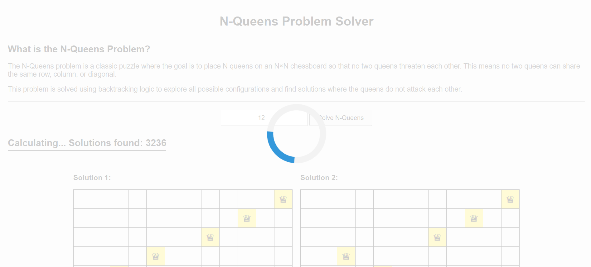
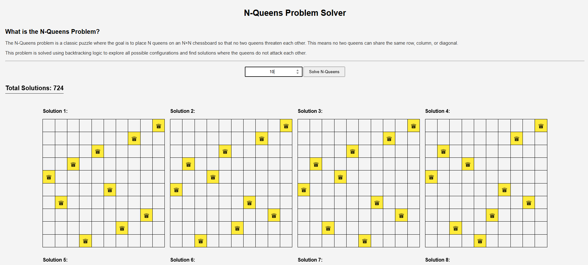

# N-Queens Problem Solver

A visual solution to the classic N-Queens problem using backtracking. Place N queens on an N×N chessboard so that no two queens threaten each other.

**Live Demo:** https://kareemh-1.github.io/NQueens/

## The N-Queens Problem

The N-Queens problem is a classic puzzle where the goal is to place N queens on an N×N chessboard so that no two queens can attack each other. This means no two queens can share the same row, column, or diagonal. The problem is solved using a backtracking algorithm to explore all possible configurations.

## Features

- Interactive web interface to solve N-Queens for any board size
- Visual representation of all possible solutions
- Backtracking algorithm implementation
- Real-time solution display

## How to Use

1. Open `index.html` in your web browser
2. Enter the value of N (board size)
3. Click "Solve N-Queens" to find all solutions
4. View all possible configurations where queens don't attack each other

## Screenshots

### Calculating Solutions

### Solution Output

